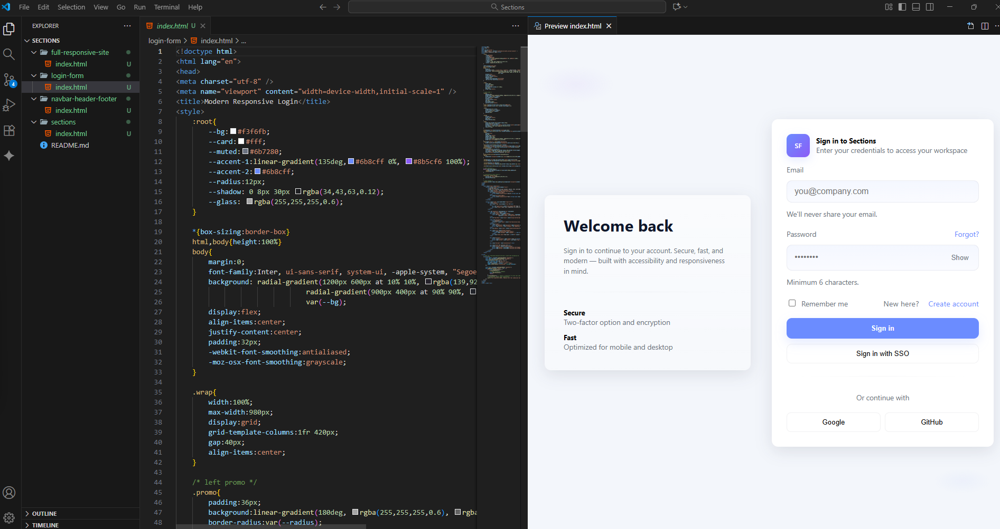
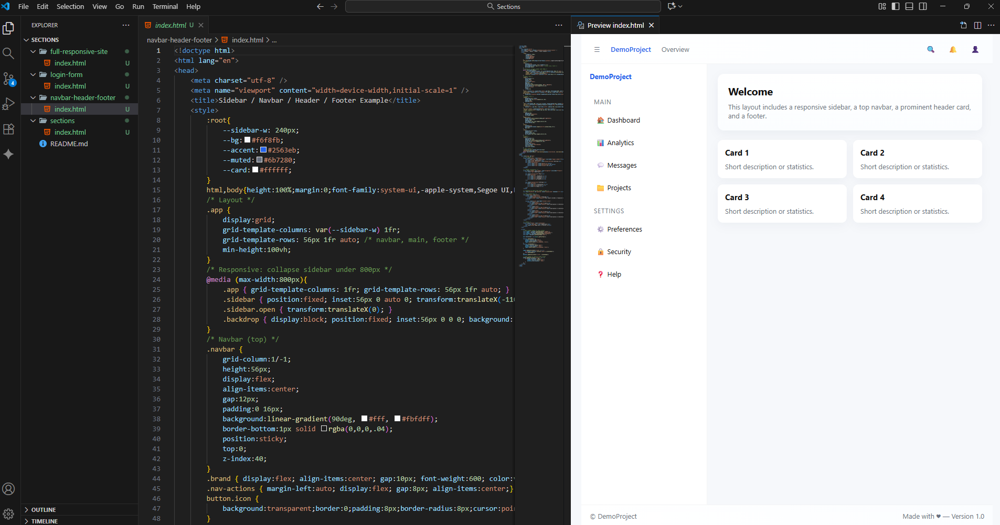
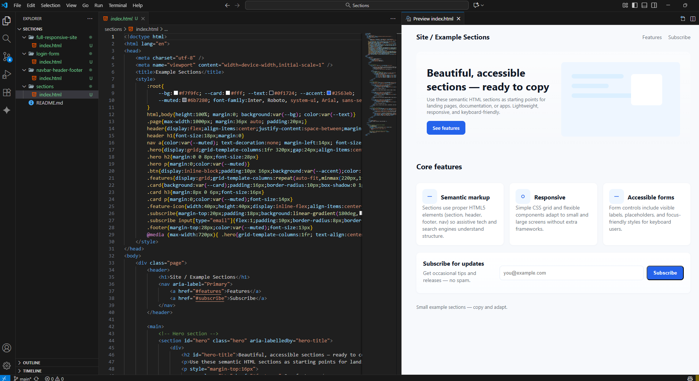
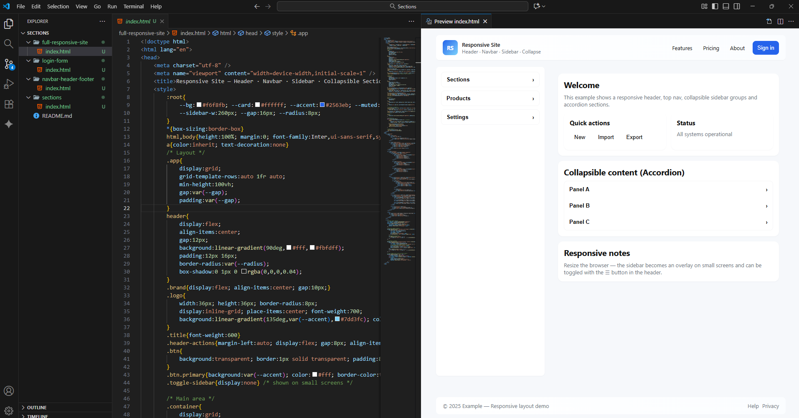

# Sections

In this repository you can find some basic examples about how to use sections, headers, navbar, menus, and footer for your web site

## Responsive Login

## Example Navbar

## Example Sections

## Responsive Site

